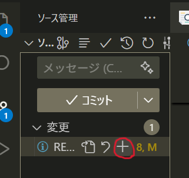
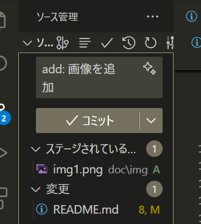
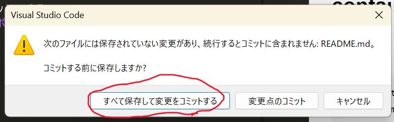
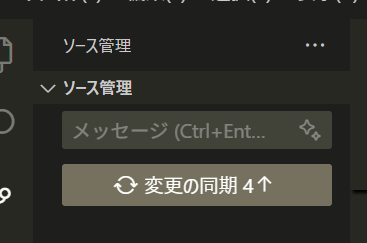

# nanachan-doll

## プログラムの実行方法
以下のコマンドを順に実行する（初回のみ。２回目以降はrunのみ）

## container
### build
```bash
docker network create net_nana
docker compose build
```

### run
```bash
docker compose up
```

## プログラムを編集したら

1. add
編集したファイルをステージングする


2. commit
コミットメッセージを記入しコミットする
コミットボタンを押下すると、メッセージが表示されるかも（「はい」を選択するなどして無視する）



3. push
リモートにプッシュする


